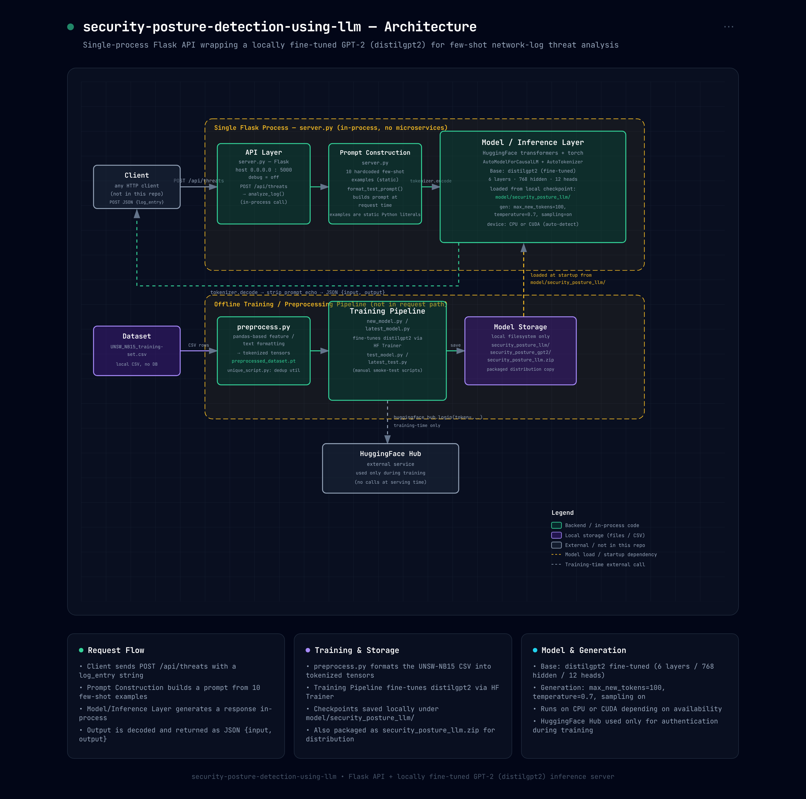
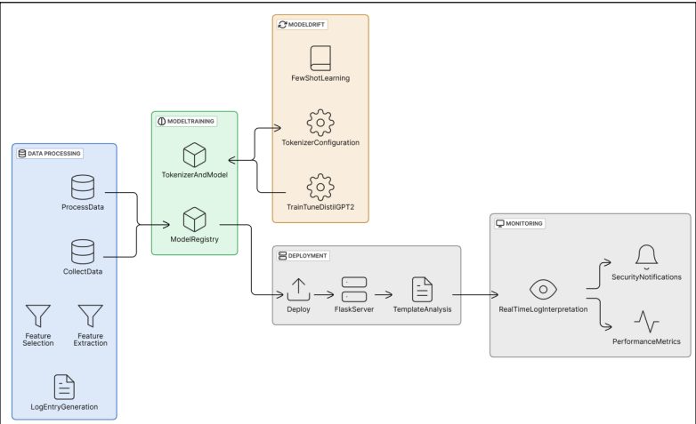
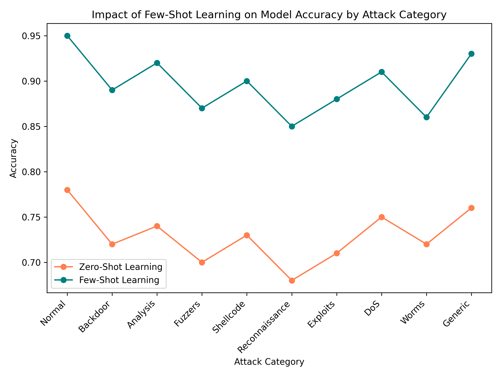
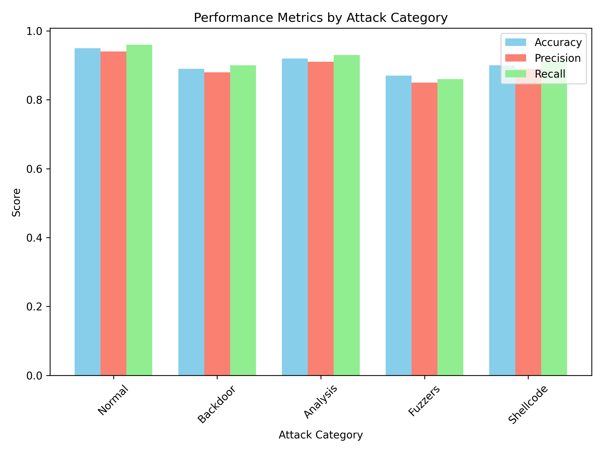
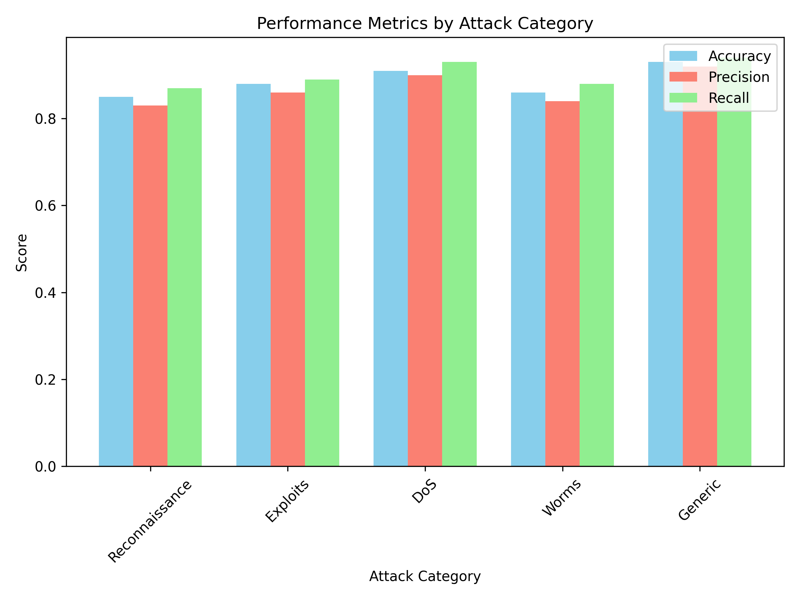

# Security Posture Detection using LLM

A Flask API that wraps a locally fine-tuned GPT-2 (`distilgpt2`) model to perform few-shot, natural-language threat analysis of network log entries. Given a structured log record (protocol, duration, byte counts, ports, etc.), the model generates a human-readable interpretation of the observed activity — normal traffic, reconnaissance, DoS, exploits, backdoors, and more.

This is a B.Tech Major Project. Full methodology, dataset details, and evaluation are documented in the accompanying paper: **[Paper.pdf](./Paper.pdf)**.

## How it works

- The model is fine-tuned on the **UNSW-NB15** intrusion detection dataset, where each network flow record is paired with a natural-language security analysis.
- At inference time, the server builds a **few-shot prompt** — 10 curated `Input → Output` examples covering each attack category — and appends the incoming log entry.
- The model generates a continuation, which is decoded and returned as the threat analysis.
- Everything runs in a single Flask process; there are no external calls at serving time (Hugging Face Hub is only used during training, to pull the base model).

### Architecture



### Pipeline overview



## Project structure

```
flaskServer/
├── server.py                     # Flask API — loads the fine-tuned model and serves /api/threats
├── Paper.pdf                     # Project paper (methodology, dataset, results)
├── diagram.png                   # High-level pipeline diagram
├── security-posture-llm-architecture.png  # Detailed architecture diagram
├── few_shot_learning.png         # Few-shot vs zero-shot accuracy comparison
├── performance_metrics_part1.png # Accuracy / precision / recall by attack category
├── performance_metrics_part2.png
└── model/
    ├── preprocess.py             # Formats UNSW-NB15 CSV rows into tokenized prompt/target pairs
    ├── latest_model.py           # Fine-tunes distilgpt2 on the preprocessed dataset (few-shot)
    ├── new_model.py              # Alternate training script
    ├── latest_test.py / test_model.py  # Manual smoke-test scripts for a trained checkpoint
    ├── unique_script.py          # Dataset utility (unique attack categories)
    ├── UNSW_NB15_training-set.csv     # Training dataset (gitignored)
    └── security_posture_llm/          # Fine-tuned model checkpoint (gitignored)
```

> Note: the trained checkpoint (`model/security_posture_llm/`), raw dataset CSVs, and training artifacts are excluded via `.gitignore` since they're large binary/data files. See [Model checkpoint](#model-checkpoint) below for how to obtain or regenerate them.

## Tech stack

- **Flask** — HTTP API
- **PyTorch** + **Hugging Face Transformers** — model training and inference
- **distilgpt2** — base causal language model, fine-tuned for this task
- **pandas** — dataset preprocessing
- **UNSW-NB15** — network intrusion detection dataset used for fine-tuning

## Setup

### Prerequisites

- Python 3.9+
- pip
- (Optional) CUDA-capable GPU for faster training/inference — the server auto-detects and falls back to CPU

### Installation

```bash
git clone https://github.com/soham-dixit/security-posture-detection-using-llm.git
cd security-posture-detection-using-llm

python -m venv venv
source venv/bin/activate      # Windows: venv\Scripts\activate

pip install flask torch transformers pandas tqdm huggingface_hub
```

### Model checkpoint

`server.py` expects a fine-tuned model at `model/security_posture_llm/`. You have two options:

1. **Unzip the provided archive**: extract `model/security_posture_llm.zip` into `model/security_posture_llm/`.
2. **Train it yourself** — see [Training](#training) below.

### Running the API

```bash
python server.py
```

The server starts on `http://0.0.0.0:5000`.

### Usage

Send a network log entry to `/api/threats`:

```bash
curl -X POST http://localhost:5000/api/threats \
  -H "Content-Type: application/json" \
  -d '{
        "log_entry": "dur: 3.210123, proto: tcp, service: ssh, spkts: 20, dpkts: 15, sbytes: 5000, dbytes: 3000, attack_cat: Backdoor, label: 1"
      }'
```

Response:

```json
{
  "input": "dur: 3.210123, proto: tcp, service: ssh, spkts: 20, dpkts: 15, sbytes: 5000, dbytes: 3000, attack_cat: Backdoor, label: 1",
  "output": "Potential backdoor activity via SSH with notable data exchange, suggesting unauthorized system access."
}
```

## Training

The training pipeline lives under `model/`:

1. **Preprocess** the raw UNSW-NB15 CSV into tokenized prompt/target tensors:
   ```bash
   cd model
   python preprocess.py
   ```
2. **Fine-tune** `distilgpt2` on the formatted dataset:
   ```bash
   python latest_model.py
   ```
   This saves the resulting checkpoint to `model/security_posture_llm/`.
3. **Smoke-test** the trained model:
   ```bash
   python test_model.py
   ```

> ⚠️ Before running training scripts, set your Hugging Face token via the `HUGGINGFACE_TOKEN` environment variable (or `huggingface-cli login`) rather than hardcoding it in source.

## Results

**Few-shot vs. zero-shot accuracy by attack category:**



**Precision / recall / accuracy by attack category:**




Full evaluation methodology and discussion are in [Paper.pdf](./Paper.pdf).

## License

Licensed under the [MIT License](./LICENSE).
